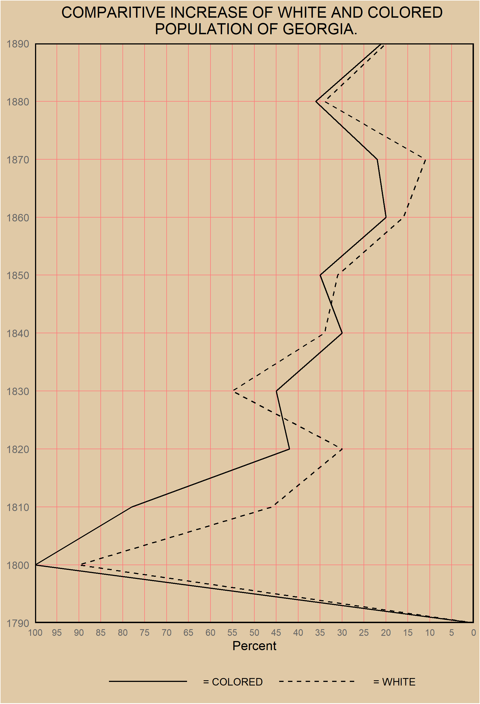

```{r setup, include=FALSE}
knitr::opts_chunk$set(collapse = TRUE)
```

**The goal of this challenge was to celebrate the data visualization legacy of W.E.B DuBois by recreating the visualizations from the 1900 Paris Exposition using modern tools.**

**Here is the original plot that I am attempting to recreate**
<br>


**Here is my recreation**
```{r message=FALSE, warning=FALSE}
# Load in packages...
library(tidyverse)
library(skimr)
library(naniar)
library(tidytuesdayR)
library(reshape)
```

```{r}

# Read in the tidy data manually

year <- c(1790, 1800, 1810, 1820, 1830, 1840, 1850, 1860, 1870, 1880, 1890)
colored <- c(0, 100, 78, 42, 45, 30, 35, 20, 22, 36, 21)
white <- c(0, 90, 46, 30, 55, 34, 31, 16, 11, 34, 20)
vars <- c(0, 0, 0, 0, 0, 0, 0, 0, 0, 0, 0)

dat <- data.frame(year, colored, white, vars)


# First im going to melt the variables, this makes them more accesible
dat <- melt(dat, id.vars = "vars", measure.vars = c("colored", "white")) 
dat$year <- c(1790, 1800, 1810, 1820, 1830, 1840, 1850, 1860, 1870, 1880, 1890)

georgia_line <-
  ggplot(data = dat) +
  geom_line(mapping = aes(y = value, x = year, linetype = variable)) +
  labs(
    title = "COMPARITIVE INCREASE OF WHITE AND COLORED \n POPULATION OF GEORGIA.",
    x = NULL,
    y = "Percent"
  ) +
  scale_y_reverse(lim = c(100,0),
                  breaks = seq(0, 100, by=5),
                  expand = c(0,0)) +
  scale_x_continuous(breaks = year,
                     limits = c(1790, 1890),
                     expand = c(0,0)
                                
  ) +
  scale_linetype_manual(labels = c("= COLORED", "= WHITE"),
                        values = c("solid", "dashed")) +
  # flipping the traditional coordinates where year on the x-axis to year on the
  # y-axis
  coord_flip() +
  theme(plot.title = element_text(hjust = 0.5),
        legend.position = "bottom",
        legend.key.width = unit(3,"cm"),
        legend.background = element_rect(fill = "#E0C9A6"),
        legend.title = element_blank(),
        panel.border = element_rect(color = "black",
                                    fill = NA,
                                    size = 1),
        plot.background = element_rect(fill = "#E0C9A6"),
        panel.background = element_rect(fill = '#E0C9A6'),
        panel.grid.major = element_line(color = '#ff7a7a', size = .25),
        panel.grid.minor = element_line(color = '#E0C9A6'),
        legend.spacing = unit(10, "char"),
        legend.key = element_blank(),
        axis.ticks.x = element_blank(),
        axis.ticks.y = element_blank(),
        axis.text.y = element_text(colour = "grey40"),
        axis.text.x = element_text(size = 8, colour = "grey40")
        )

# saving it so I can adjust dimensions
ggsave("DuBois_Challenge_01.png", georgia_line, width = 5.8, height = 8.5)

```
<br>



